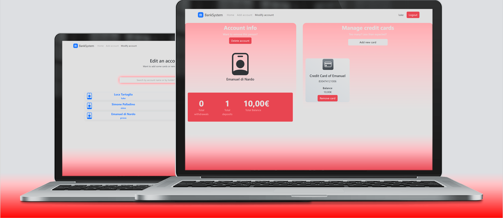
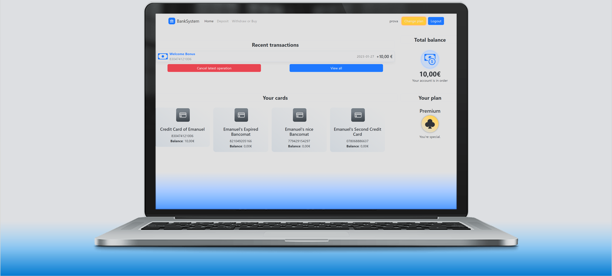
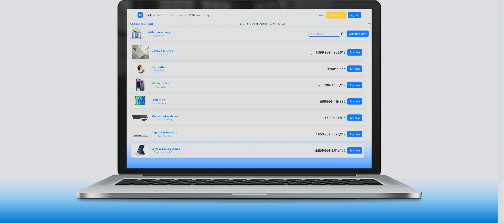

# 🏦 BankSystem

BankSystem is a **Java-based web application** designed to manage bank accounts and related operations with **role-based access** for administrators and account holders.  
Built using **Java Servlets**, **JSP**, **Apache Tomcat**, and **SQLite**, it follows clean architecture principles and multiple design patterns (DAO, Observer, Factory, Iterator, MVC) for scalability, maintainability, and clarity.

---

## 📋 Features

### 🔑 Role-Based Access
- **Administrator**:
  - Add a new account holder (search by name or account number).
  - Remove an account holder (search by name or account number).
- **Account Holder**:
  - View transaction history for all cards and aggregated accounts.
  - Make purchases using associated cards (Debit or Credit).
  - Request to undo the last transaction.
  - Withdraw or deposit funds, selecting the target card.
  - Access services based on account type: **Basic**, **Premium**, or **Enterprise**.

---

## 💳 Account Rules & Limits
- **Basic**:
  - Max daily deposit: €5,000.
  - Max daily spend: €2,000 per card, up to 3 transactions.
  - Credit card overdraft limit: -€10.
- **Premium**:
  - Max daily deposit: €50,000.
  - Max daily spend: €10,000 per card, up to 10 transactions.
  - Credit card overdraft limit: -€100.
- **Enterprise**:
  - Max daily deposit: €1,000,000.
  - Max daily spend: €100,000 per card, unlimited transactions.
  - Credit card overdraft limit: -€1,000.
- **Debit cards** cannot go below €0 balance.

---

## 🛠 Technical Details

### **Architecture & Patterns**
- **DAO (Data Access Object)** – Separates business logic from database persistence.
- **Observer** – Notifies cards and accounts of changes like deposits, withdrawals, or card assignments.
- **Factory** – Creates operations and iterators without exposing instantiation logic.
- **Iterator** – Sequentially iterates through accounts, cards, and transactions.
- **MVC (Model-View-Controller)** –  
  - **Model**: Data classes and DAO operations.  
  - **View**: JSP/HTML interfaces.  
  - **Controller**: Java Servlets handling HTTP requests and user interactions.

### **Database**
- **SQLite** for data storage.
- External tables:
  - `CRIPTED` – Encrypted passwords.
  - `PRODUCTS` – Items purchasable within the system.
  - `ADMINS` – Administrator accounts.
- **JDBC** for database connectivity.

### **Security**
- Passwords stored in encrypted form with key–value mapping in `CRIPTED` table.
- Secure session handling for login and role management.

---

## ⚡ Exception Handling
Custom exceptions enforce banking rules:
- `DepositExceedException` – Daily deposit limit exceeded.
- `NoFundsException` – Insufficient funds or overdraft limit exceeded.
- `WithdrawExceedException` – Withdrawal or purchase exceeds daily limits.

---

## 🚀 How It Works
1. **Admin Login** – Manage account holders and system data.
2. **Holder Login** – Access personal banking dashboard.
3. **Perform Transactions** – Deposits, withdrawals, purchases, and refunds.
4. **Observer Updates** – Cards and accounts automatically reflect changes.
5. **Data Persistence** – All operations saved via DAO to the SQLite database.

---

## 📸 Screenshots

### Admin Dashboard


### Holder Dashboard


### Withdraw Page


---

## 📦 Installation
1. Clone the repository:
   ```bash
   git clone https://github.com/your-username/BankSystem.git
